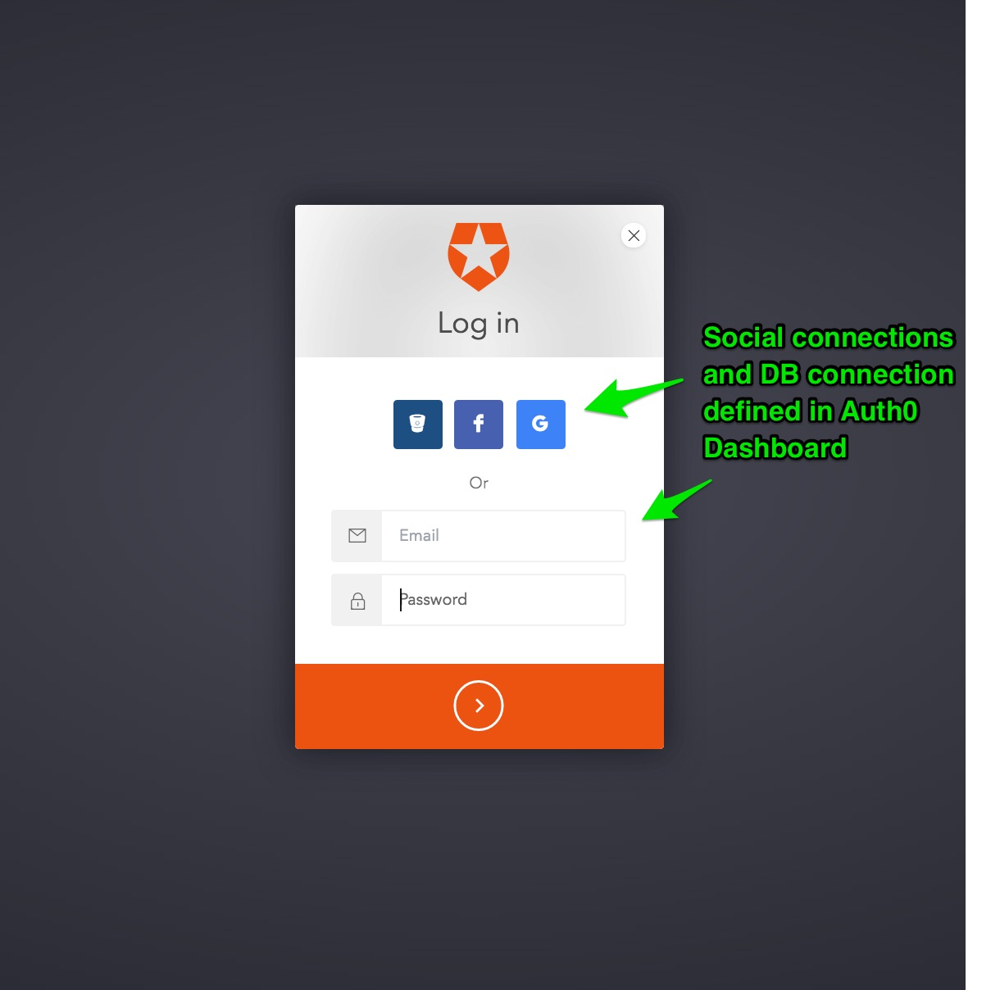

## Demonstrates using Auth0 with Java using plain Servlets and JSP pages.

This is a companion sample for the [Auth0 Servlet](https://github.com/auth0/auth0-servlet) library.
Please refer to that library and documentation for further information specific to the library itself.

A simple (plain) Java web application that demonstrates how to use Auth0 with Java for server-side MVC web apps.
Validates the JWT from Auth0 in every API call to assert authentication according to configuration. If your application only needs secured endpoints and the ability to programmatically work with a Principal object for GrantedAuthority checks this library is a good fit.

However, if you are already using Java Spring and wish to leverage fully Java Spring Security - with powerful support for Security Annotations, Security JSTL Tag libraries, Fine-grained Annotation level method security and URL endpoint security at the Role / Group level - then see this project
[Auth0 Spring Security MVC](https://github.com/auth0/auth0-spring-security-mvc) and associated sample
[Auth0 Spring Security MVC Sample](https://github.com/auth0-samples/auth0-spring-security-mvc-sample)

If you are not ready for Java Spring Security yet, but would prefer to be using Java Spring (Boot), and leverage the benefits of convention over configuration, dependency injection and so on, then this project [Auth0 Spring MVC](https://github.com/auth0/auth0-spring-mvc)
and associated sample [Auth0 Spring MVC Sample](https://github.com/auth0-samples/auth0-spring-mvc-sample)

### Prerequisites

In order to run this example you will need to have Java 7+ and Maven installed.

Check that your maven version is 3.0.x or above:

```sh
mvn -v
```

### Setup

Create an [Auth0 Account](https://auth0.com) (if not already done so - free!).


#### From the Auth0 Dashboard

Create an application - for the purposes of this sample - `app`

Ensure you add the following to the settings.

Allowed Callback URL:

```
http://localhost:3099/callback
```

Ensure you add the following to the settings.

Allowed Logout URLs:

```
http://localhost:3099/logout
```

Add one or more `connections` to your application - for instance Google Social Connection,
or username-password DB connection.


### Inside the Application - update configuration information

Enter your:

`auth0.domain`, `auth0.issuer`, `auth0.clientId`, and `auth0.clientSecret` into `src/main/webapp/WEB-INF/web.xml`

Note:

`auth0.issuer` should have the value `https://YOUR_DOMAIN.auth0.com/` (the trailing slash is important).
For example, if your `auth0.domain` is `example.auth0.com` then `auth0.issuer` should have value `https://example.auth0.com/`.

### Build and Run

In order to build and run the project you must execute:

```sh
mvn clean install tomcat7:run
```

Then, go to [http://localhost:3099/login](http://localhost:3099/login).

---

### Screenshots of the overall flow (minus growler notifications):


#### 1.Login



#### 2. Home


